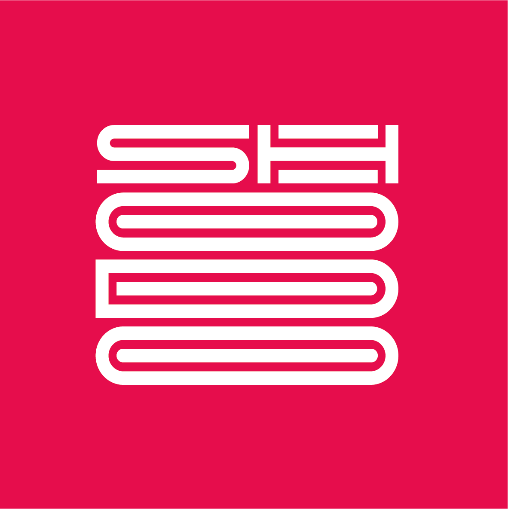

## 2022 - Shodo

{: .align-left .comment__avatar}

Software Engineer (current position)

{: .align-right .comment__avatar}

### ARVAL ( current position )

👷🏾‍♂️ **Role**  : *Tech Lead*

#### 🛠️ Key Technologies

> Spring Boot 3.X, Java 17-21, Kotlin, Angular 15, IbmCloud, Kubernetes
> Postgres, MongoDB, Kafka

#### Key Projects

- Service Locator - An application that allows users to locate nearest Arval garages and book appointments for repairs. 
- Service notification - A generic application that allows applications to reach users through multiple channels (email, SMS, Microsoft Teams, etc.) 
- Arval Charging Services Hub - aims at managing services related Electric Vehicles charge points ( Create quotation, contract life cycle, charging transactions collection) 
- Bulk Loader Module - Create contacts in SalesForce in bulk and synchronize the Core Leasing Systems with additional data.  
- Vehicles Catalog API - Expose the vehicles catalog and allows options confiugration  
- Stripe Data Collector - Collects payout reconciliation reports from Stripe. 

#### 🌟 Notable Achievements And Responsibilities

- Spearheaded the adoption of Domain-Driven Design (DDD) principles, fostering alignment between technical teams and business objectives.
- Facilitated collaborative workshops such as EventStorming, Example Mapping, and Domain Storytelling ...
- Conducted in-depth project analyses using DORA (DevOps Research and Assessment) metrics, identifying bottlenecks and implementing data-driven improvements to optimize team performance.
- Played a key role in architectural design discussions, advocating for Hexagonal Architecture to ensure modularity, scalability, and maintainability.
- Championed pair programming and mob programming methodologies, promoting knowledge sharing and collaborative problem-solving.
- Explored and applied the NoEstimates approach to software development, focusing on value delivery and continuous improvement.

## 2020 - Xebia France

{: .align-left .comment__avatar}

Software Engineer

{: .align-right .comment__avatar}

### Paylib (1½ year)

`👷🏾‍♂️ **Role**  : *Backend developer*

#### 🛠️ Key Technologies

> Spring, Java, Kotlin, Openshift, hexagonal architecture, Gatling, MongoDB, Redis, Gitlab-ci

#### Key Projects
- Paylib App - A mobile application that allows users to make peer to peer payments and manage expenses group.

{: .align-right .comment__avatar}

### Nissan (6 months)

👷🏾‍♂️ **Role**  : *AWS Cloud Developer*

#### 🛠️ Key Technologies

> Java, Kotlin, Python, SHELL, AWS Batch, AWS Step Functions, AWS Lambda,  AWS Api Gateway, ECR, IAM, S3, CodeCommit, CODEPIPELINE, CodeBuild, Terraform

#### Key Projects

- New Inventory - Revamp of the Inventory Project. New Inventory is a solution designed to update and refresh Nissan vehicle stock across dealerships in all European markets.

## 2018 - WELL'D

{: .align-left .comment__avatar}

Software Engineer

{: .align-right .comment__avatar}

### SNCF (2½ years)

👷🏾‍♂️ **Role**  : *AWS Cloud Developer*

#### 🛠️ Key Technologies

> Java, Kotlin, AWS EC2, Ansible, Terraform, Gitlab-ci

#### Key Projects

- OpenGOV - a sophisticated application designed to optimize track occupancy management in major railway stations. It enables efficient train placement on tracks while ensuring compliance with safety regulations and operational constraints, enhancing the overall coordination of station activities.

## 2018 - ADP (3 years)

{: .align-left .comment__avatar}

👷🏾‍♂️ **Role**  : *Java & Cobol Developer*

#### 🛠️ Key Technologies

> Java, Javascript, COBOL

#### Key Projects

- GXPLink & ZXPLink - a comprehensive solution tailored for enterprise clients, enabling them to efficiently manage payroll, oversee personnel administration, handle regulatory reporting and sick leave, and implement strategic HR management.
